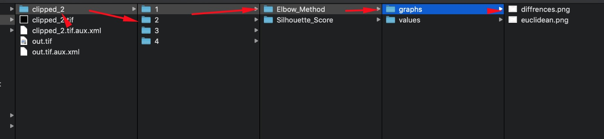
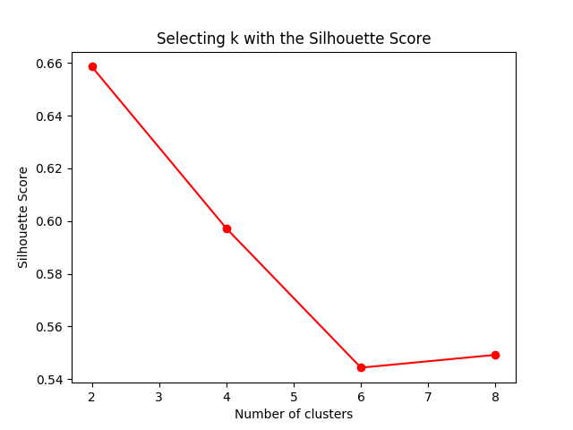
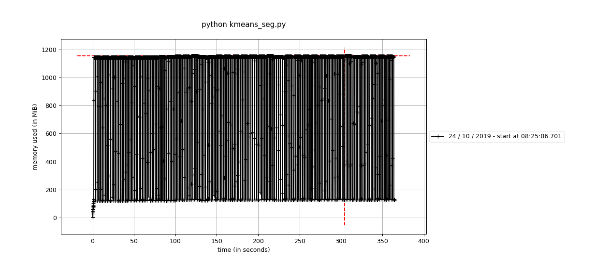

# GTU Satellite Image Segmantation Service
Bu proje K-Means Clustering kullanılarak Uydu Görüntüleri üzerinde cluster sayısının (k) en optimum şekilde belirlenmesi amacıyla oluşturulmuştur. Çalışmada her band için ayrı ayrı clustering yapılarak Elbow Method, Local Variance ve Silhouette Score 'a göre k değerinin  optimizasyonu için her bir cluster'a ait değerleri değerleri arasındaki farkları JSON formatında kayıt eder ve grafik üzerinde gösterir. Kullanıcıya k değerinin seçiminde öneri yapmak amaçlanmaktadır.

## Yazılımın Kurulumu
Kurulum için docker kurulu olmalıdır. Docker kullanılmadan kurulum için requirements.txt içerisinde lib'ler python 3 için kurulmalıdır. Docker ile kurulum için sırası ile;

```
git clone https://github.com/zaferdurkut/gtuseg.git
```
Projeye gidilir
```
cd gtuseg
```
Çalışıcak verilere servisin ulaşabilmesi için veri klasörü oluşturulur. Çalışılacak verinin bu dizin altında olması gerekmektedir.
```
mkdir data
```
Verinin ilgili dizine verilmesi
```
cp your_path/data.tif data/
```
Servisin Kurulumu
```
docker-compose up -d --build
```
Servisin kurulumu tamamlandıktan sonra servise giriş için
```
docker exec -it gtuseg_app_1 bash
```

## Yazılın Çalıştırılması
Servise girildikten sonra K-Means Clustering k değerinin taraması için data yolu, başlangıç, bitiş ve adım değerlerinin verilmesi gerekmektedir. Verilemdiğinde 2 ile 10 arasında 2 adım sayısı ile çalışmaktadır. Data olmadan ilgili servis çalışmamaktadır.
```
python kmeans_seg.py --data data/your_data.tif --start your_start_value --end your_end_value --step your_step_value
```
Örnek
```
python kmeans_seg.py --data data/clipped_2.tif --start 2 --end 10 --step 2
```
Docker Container'a girmeden çalıştırmak için
```
docker exec -it gtuseg_app_1 python kmeans_seg.py --data data/clipped_2.tif --start 2 --end 10 --step 2
```


## Output Yapısı
Yazılım çalıştırıldıktan sonra verilen data adında yeni bir klasör oluşur. Oluşan klasör altında her band için ayrı klasörler oluşmaktadır. her bir band için algoritmalara göre yeni klasörler oluşur. Her bir algoritma altında graph altında k değerine göre algoritmadan çıkan değerler ve sıralı olarak k değerleri arasındaki fark grafikleri üretilir. values klasörü altında JSON formatında fark datası ve algoritmadan çıkan değerler bulunmaktadır.

Örnek grafik;



### Memory Kullanımının Tespiti

 İlgili script için memory kullanım datasını oluşturulması için


``
mprof run --include-children python kmeans_seg.py --data data/clipped_2.tif --start 2 --end 10 --step 2
``

İlgili memory kullanım datasından profil oluşturmak için

``
mprof plot --output memory-profile.png
``
Örnek Profil Datası




### Örnek Log Ekran Çıktısı

```
root@e54222ff6522:/app# python kmeans_seg.py --data data/clipped_2.tif --start 2 --end 10 --step 2

 Band Number: 1
	Number of Cluster: 2
	The runtime for kmean_model_train took 0.1641533374786377 seconds to complete
	The runtime for calculate_kmeans_distance took 0.011232852935791016 seconds to complete
	The runtime for calculate_silhouette_score took 9.15448808670044 seconds to complete
	Number of Cluster: 4
	The runtime for kmean_model_train took 0.22251486778259277 seconds to complete
	The runtime for calculate_kmeans_distance took 0.011094093322753906 seconds to complete
	The runtime for calculate_silhouette_score took 8.990926742553711 seconds to complete
	Number of Cluster: 6
	The runtime for kmean_model_train took 0.3546907901763916 seconds to complete
	The runtime for calculate_kmeans_distance took 0.012327194213867188 seconds to complete
	The runtime for calculate_silhouette_score took 8.595641851425171 seconds to complete
	Number of Cluster: 8
	The runtime for kmean_model_train took 0.4786539077758789 seconds to complete
	The runtime for calculate_kmeans_distance took 0.013025522232055664 seconds to complete
	The runtime for calculate_silhouette_score took 8.458919286727905 seconds to complete


	The runtime for kmeans_distance_graph_data_export took 0.3367340564727783 seconds to complete


	The runtime for silhouette_score_graph_data_export took 0.30596280097961426 seconds to complete

 Band Number: 2
	Number of Cluster: 2
	The runtime for kmean_model_train took 0.12827730178833008 seconds to complete
	The runtime for calculate_kmeans_distance took 0.01225423812866211 seconds to complete
	The runtime for calculate_silhouette_score took 9.191406488418579 seconds to complete
	Number of Cluster: 4
	The runtime for kmean_model_train took 0.2350924015045166 seconds to complete
	The runtime for calculate_kmeans_distance took 0.015206575393676758 seconds to complete
	The runtime for calculate_silhouette_score took 8.687761306762695 seconds to complete
	Number of Cluster: 6
	The runtime for kmean_model_train took 0.41832709312438965 seconds to complete
	The runtime for calculate_kmeans_distance took 0.013796091079711914 seconds to complete
	The runtime for calculate_silhouette_score took 8.513437271118164 seconds to complete
	Number of Cluster: 8
	The runtime for kmean_model_train took 0.4902801513671875 seconds to complete
	The runtime for calculate_kmeans_distance took 0.01206660270690918 seconds to complete
	The runtime for calculate_silhouette_score took 8.502135276794434 seconds to complete


	The runtime for kmeans_distance_graph_data_export took 0.304126501083374 seconds to complete


	The runtime for silhouette_score_graph_data_export took 0.32167720794677734 seconds to complete

 Band Number: 3
	Number of Cluster: 2
	The runtime for kmean_model_train took 0.11789703369140625 seconds to complete
	The runtime for calculate_kmeans_distance took 0.014729022979736328 seconds to complete
	The runtime for calculate_silhouette_score took 9.147799015045166 seconds to complete
	Number of Cluster: 4
	The runtime for kmean_model_train took 0.27987170219421387 seconds to complete
	The runtime for calculate_kmeans_distance took 0.0175931453704834 seconds to complete
	The runtime for calculate_silhouette_score took 8.718069314956665 seconds to complete
	Number of Cluster: 6
	The runtime for kmean_model_train took 0.47229719161987305 seconds to complete
	The runtime for calculate_kmeans_distance took 0.012681961059570312 seconds to complete
	The runtime for calculate_silhouette_score took 8.504289865493774 seconds to complete
	Number of Cluster: 8
	The runtime for kmean_model_train took 0.4699838161468506 seconds to complete
	The runtime for calculate_kmeans_distance took 0.012647867202758789 seconds to complete
	The runtime for calculate_silhouette_score took 8.489189624786377 seconds to complete


	The runtime for kmeans_distance_graph_data_export took 0.3444349765777588 seconds to complete


	The runtime for silhouette_score_graph_data_export took 0.31397271156311035 seconds to complete

 Band Number: 4
	Number of Cluster: 2
	The runtime for kmean_model_train took 0.1266791820526123 seconds to complete
	The runtime for calculate_kmeans_distance took 0.012109041213989258 seconds to complete
	The runtime for calculate_silhouette_score took 8.852313041687012 seconds to complete
	Number of Cluster: 4
	The runtime for kmean_model_train took 0.37636542320251465 seconds to complete
	The runtime for calculate_kmeans_distance took 0.011075019836425781 seconds to complete
	The runtime for calculate_silhouette_score took 8.535313129425049 seconds to complete
	Number of Cluster: 6
	The runtime for kmean_model_train took 0.5147209167480469 seconds to complete
	The runtime for calculate_kmeans_distance took 0.011808156967163086 seconds to complete
	The runtime for calculate_silhouette_score took 10.75607943534851 seconds to complete
	Number of Cluster: 8
	The runtime for kmean_model_train took 1.2519629001617432 seconds to complete
	The runtime for calculate_kmeans_distance took 0.017284154891967773 seconds to complete
	The runtime for calculate_silhouette_score took 9.567536354064941 seconds to complete


	The runtime for kmeans_distance_graph_data_export took 0.3157665729522705 seconds to complete


	The runtime for silhouette_score_graph_data_export took 0.2994685173034668 seconds to complete

	-----------------------------------------------------------------------------

	The runtime for kmean_clustering took 151.54123330116272 seconds to complete
```